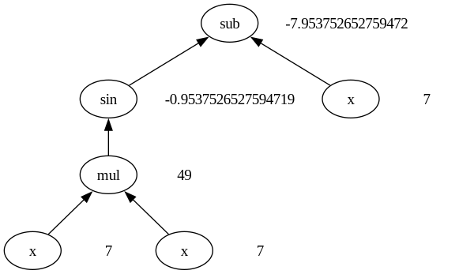
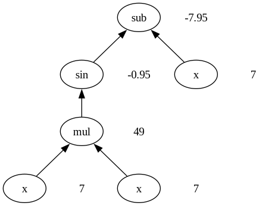

## DEAP tree visualiser
This is a program designed to make visualisation of the trees produced by deap easy! (hopefully)

This module consists of two parts:
## Tree
A class that takes a deap expression and breaks it down into a tree based structure that can be more easily reasoned with. In general this is just an intermediate step to graphically visualising a tree. But can be a useful tool for visualising in an interactive session like a debugger.
```python
tree = Tree.of(gp_individual_to_visualise, pset)
```
## TreeDrawer
A class that takes a given tree, and draws it for some input. eg.
```python
TreeDrawer().save_graph("file/path/to_save/the_image", tree, input_1, ..., input_n)
```
The `TreeDrawer` is designed to be extensible if you want it, as shown in the [Examples](##examples).

## Examples
### Symbolic Regression
```python
tree = Tree.of(best_individual, pset)
# Visualise for some specific input
TreeDrawer().save_graph("base_tree_drawer_example.png", tree, 7)
```


Now you may say "Hold on those numbers look a little ugly, maybe my visualisation should round these numbers" of course you may not say actually say this.

This is as simple as:
```python
round_drawer = TreeDrawer().register_draw_function(
    lambda tree: isinstance(tree.value, float),
    lambda graph, tree: draw_text(graph, tree, round(tree.value, 2))
)

round_drawer.save_graph("rounded_tree_drawer_example.png", tree, 7)
```


We can add custom drawing functions with the `register_draw_function`, the first argument tells us when to use our custom drawing method (in this case if the value stored in that tree node is a float. And then second is what to draw if that condition is true. For your convience this library also has `draw_text` and `draw_image` functions which you can import.

The current defaults are set as so:
```python
self\
    .register_draw_function(lambda _: True, draw_text)\
    .register_draw_function(lambda t: is_image(t.value), draw_image)\
    .register_draw_function(lambda t: t.function.arity == 0 and "ARG" not in t.function.name, lambda *_: None)
```
Since new drawing functions/predicates override the old ones, the default flow looks like this:
1. If the function has an `arity` of 0 (is a terminal in the tree) and is not an argument, don't draw anything at at all
2. If the image "is an image" the default assumes any 2D array is an image
3. Otherwise draw it as text (`lambda _: True`) acts as a catch all.

If these defaults don't work for you, you can use `TreeDrawer().clear_defaults()` and then register all new draw functions.
